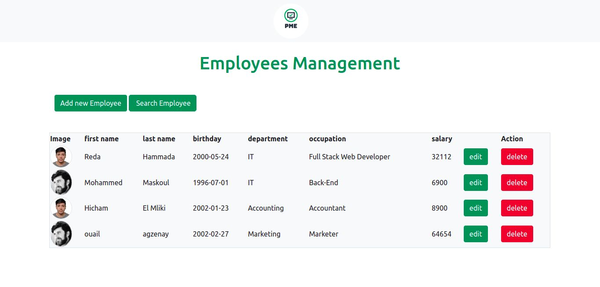

# Employees-Management-Project   

## About:     

PME app is a mini back-end application for small and meduim enterprises i built after i learnt the basics of PHP and SQL using MySQL database management system as a challenge, it is an application that helps managers to add information about employees and update it, and delete it, which i will work on adding many features 
to this application later.    

## Built With:  

HTML5  
CSS3  
Bootstrap V5.1  
Javascript  
PHP  
SQL    

## Live :   

[PME app](https://pmeapp.herokuapp.com/)    

  

### Author:    
  
-Github: [Reda-Hammada](https://github.com/Reda-Hammada)   
-LinkedIn: [Reda Hammada](https://www.linkedin.com/in/reda-hammada/)     
-Portfolio:[www.hammada-reda.com](https://www.hammada-reda.com/)    

